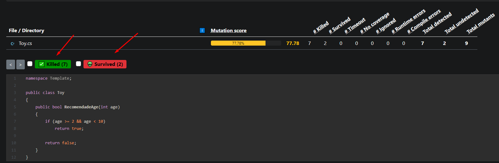

# Testes de mutação com Stryker.NET

Um pouco sobre a biblioteca
----
Stryker.NET é uma biblioteca que oferece testes de mutação para .NET, ele permite que você teste seus testes unitários inserindo bugs temporariamente, é importante lembrar que a biblioteca só pode ser usado para aplicações .net 5 e adiante

Sobre os testes
----
O teste de mutação ou testes mutantes são feitos para avaliarem a bateria de testes do seu código. O conceito é modificar uma parte do seu código, implementando bugs ou "mutantes" fazendo com que seus testes quebrem e encontrando possíveis falhas ou erros. Seus testes são executados para cada mutante. Se seus testes falharem, o mutante sobrevive. Se seus testes passarem, o mutante é morto. Quanto maior a porcentagem de mutantes mortos, mais eficazes serão seus testes.

Os estados dos mutantes:
* Killed: Quando pelo menos um teste falhou enquanto este mutante estava ativo, o mutante é morto
* Survived: Quando todos os testes passaram enquanto este mutante estava ativo, o mutante sobreviveu.
* No Coverage: O mutante não é coberto por um de seus testes e sobreviveu como resultado. 

Iniciando o projeto
----
Neste exemplo utilizaremos o xunity para nossos testes, você poderá estar utilizando este [Template](https://github.com/Eliandro-Freitas/TemplateMutationTests.git) com as classes e os testes já implementadas para adiantar o processo ou clonando o projeto diretamente pelo link https://github.com/Eliandro-Freitas/TemplateMutationTests.git

Com o template aberto teremos uma classe chamada **Toy** com um método **RecomendadeAge** 
Temos uma situação que esse brinquedo é recomendado para crianças entre 2 e 10 anos
```csharp
public class Toy
{
    public bool RecomendadeAge(int age)
    {
        if (age >= 2 && age < 10)
            return true;

        return false;
    }
}
```

Apenas com esses dois métodos teremos testados as duas condicionais e os testes irão passar, mas a nossa demanda não será atendida, precisamos que a idade seja entre 2 e 10 anos e aqui está até 9 anos, é apenas um sinal  de '=' que as vezes passa despercebido que poderá trazer um BUG na hora de rodar seu código em produção
```csharp
public class ToyTests
{
    [Fact]
    public void ShouldReturnTrueWhenAgeIsRecomendade()
    {
        var result = new Toy().RecomendadeAge(4);
        result.Should().BeTrue();
    }

    [Fact]
    public void ShouldReturnFalseWhenAgeIsNotRecomendade()
    {
        var result = new Toy().RecomendadeAge(15);
        result.Should().BeFalse();
    }
}
```

Agora vamos adicionar a biblioteca
----
Com o template em mãos ou no seu projeto de preferência, entre no package manager console do visual studio ou entre na pasta com o cmd ou powerShell onde seu projeto principal foi criado e execute o comando

```dotnet tool install -g dotnet-stryker```

E o Stryker
----
No windows explorer navegue até onde está salvo o arquivo csproj do seu projeto de testes e digite o comando ```dotnet Stryker``` e de enter para executar

### Você verá uma janela como essa 


### Copie a URL gerada e cole no seu browser de preferência para abrir o relatório


### Com o browser aberto teremos nosso relatório mostrando quantos mutantes foram criandos, sobreviveram ou morreram com as mutações criadas e também o nosso **score** , os mais importantes para nós são a quantidade de mutantes que sobreviveram aos testes, eles são indicativos de testes que estão faltando


